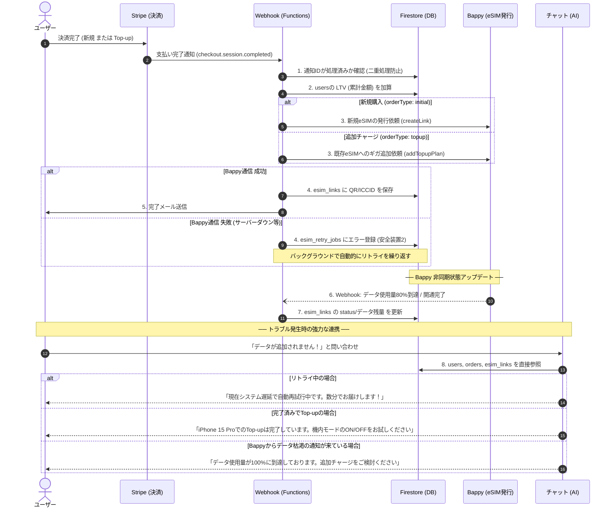

# yah.mobile 決済・eSIM発行システム仕様書

このドキュメントは、yah.mobileアプリにおける「決済（Stripe）」から「eSIM発行（Bappy）」、そして「データ分析」までの流れを、初心者の方でも理解できるように図解・解説した仕様書です。今回実装される最新の改善内容も含んでいます。

---

## 1. 決済からeSIMが届くまでの全体像

ユーザーが「eSIMを購入するボタン」を押してから、実際にスマホでeSIMが使えるようになるまでは、大きく分けて3つのシステムがバケツリレーのように連携しています。

1. **yah.mobile（私たちのシステム / Firebase）**
2. **Stripe（クレジットカード決済を代行するシステム）**
3. **Bappy（世界中のeSIMを発行する通信プロバイダ）**

### 🛒 全体の流れ（正常時）
1. ユーザーがアプリでプランを選び、「購入」ボタンを押す。
2. yah.mobile は「注文書（Order）」をデータベースに作り、**Stripeの決済画面**へユーザーを移動させます。
3. ユーザーがクレジットカードで支払いを完了します。
4. Stripeからyah.mobileの裏側（Webhook）へ**「支払い完了しましたよ！」という通知**が届きます。
5. 通知を受け取ったyah.mobileは、**Bappyに「eSIMを作って！」と依頼**します。
6. BappyがeSIM（QRコード情報）を作って返してくれます。
7. yah.mobile はそれをデータベースに保存し、ユーザーにメールでQRコードを送ります。

---

## 2. データベースの構成（No MySQL レガシー・Firestoreネイティブ）

「誰が」「何を」「どれだけ」買ったのかを整理するため、システムは旧来のリレーショナルデータベース（MySQL等）への依存を完全に断ち切り、**「No MySQL レガシー」**を掲げたFirestore（NoSQL）ネイティブな設計で整理整頓されています。

### 🚀 Firestoreネイティブによる設計の極意（N+1問題の解消）
NoSQLの最大の強みである「非正規化（関連データの埋め込み）」を活用し、複数テーブルを結合（JOIN）しなくても、1回のクエリで画面表示に必要なデータが全て揃う構造になっています。これにより、数万人のユーザーが同時にアクセスしてもサーバーが落ちない「爆速」の読み込み速度を実現しています。

### 🧑‍💻 ① ユーザー情報（`users`）
「人」の基本情報と、マーケティングに必要な**分析データ**が入る箱です。
* **基本情報:** 名前、メールアドレス、Stripeのお客さんID（次回からカード入力を省くため）
* **分析・売上データ (`metrics`):** LTV（これまでに合計いくら使ってくれたか）、購入回数
* **属性・地域データ (`demographics`):** 国籍（`nationality`）、居住国、タイムゾーン（通知の最適化用）
* **マーケティング・紹介 (`marketing`):** どの広告から来たか（`utm_source`）、誰の紹介か（`referredBy`）、使ったプロモコード
* **端末データ (`device`):** スマホの機種（例: iPhone 15 Pro）、OSバージョン（eSIMの互換性チェック用）
* **ユーザー設定 (`preferences`):** メルマガやプロモーションの受信許可（`emailOptIn`）

> [!TIP]
> **なぜ分析データをここに入れるの？**
> 「1万円以上買ってくれている日本のお客さん」を検索したい時、注文履歴を全部足し算するのは大変です。決済が完了するたびに、この `users` 箱の「LTV（累計金額）」を自動で書き換えることで、一瞬で分析ができるようになります。

### 📦 ② 注文履歴（`orders`）
毎回の「お会計」の履歴が入る箱です。
* **内容:** いつ、どのプランを、いくらで買ったか。決済ステータス（支払い待ち / 支払い完了 / エラー）。
* ユーザー情報（①）とは独立して存在し、「誰の注文か（`userId`）」という名札がついています。
* **何ができるか（売上分析）:** `discountAmount` や `promoCode` が記録されるため、インフルエンサー施策や割引キャンペーンの売上効果測定が、単一のデータベースで完結します。

### 📱 ③ eSIM情報（`esim_links` - Single Source of Truth）
発行されたeSIMそのもののデータが入る箱です。
* **内容:** QRコードのURL、ICCID（eSIMのシリアル番号）、残りのデータ容量、ステータス。
* 注文履歴（②）の完了と同時に作られます。
* **何ができるか（非正規化による爆速表示）:** 購入したプラン名（`planName`）や合計ギガ数（`totalDataGb`）が**直接このドキュメント内に埋め込まれている**ため、アプリ側は「`esim_links` を1回取得するだけ」で、「日本 10GBプラン（残量 3GB）」というカードデザインを爆速で表示可能です。

---

## 3. 購入の種類：「新規」と「追加チャージ（Top-up）」

eSIMの購入には、実はまったく仕組みが異なる2つのパターンがあります。ここを間違えると、大事故に繋がります。

### パターンA：新規購入（Initial）
はじめてyah.mobileで海外eSIMを買う場合です。
* **やること**: Bappyにお願いして、**完全に新しいeSIM（QRコード）**を発行してもらいます。
* ユーザーは届いたQRコードをスマホで読み込んで設定します。

### パターンB：追加チャージ（Top-up）
旅行中に「ギガが足りなくなったから追加で買おう！」という場合です。
* **やること**: すでにスマホに入っているeSIMに対して、**ギガ（データ）だけを追加**してもらいます。
* ⚠️ **絶対にやってはいけないこと**: ここで新規購入と同じように「新しいQRコード」を発行してしまうと、ユーザーは「追加ギガを買ったはずなのに、別の新しいeSIMが届いた。また設定し直さないといけないの？」と大混乱します。
* **仕組み**: 決済完了時、データベースの注文が「Top-up」であるかを確認し、新しいeSIMを発行するのではなく、既存のeSIM情報（`esim_links`）に対してチャージ指示を出します。

---

## 4. 事故を防ぐ「最強の安全装置」

お金が絡むシステムでは、通信エラーやユーザーのボタン連打などで「eSIMが2回発行された」「お金だけ払ってeSIMが届かない」という事故が起きやすいです。これを防ぐための3つの安全装置を組み込んでいます。

### 🛡 安全装置1：Idempotency Key（二重決済の防止）
通信が遅い時、ユーザーが「購入ボタン」をイライラして2回押してしまうことがあります。
これを防ぐため、Stripeに決済画面を作ってもらう際、「この注文番号（OrderID）の決済画面だよ」という特別なカギを渡します。Stripeはこのカギを見て、「あ、これはさっき作った画面と同じだから、2重に請求しないでおこう」と判断してくれます。

### 🛡 安全装置2：イベントの二重処理防止（二重発行の防止）
Stripeから「支払い完了」の通知（Webhook）が、通信の不具合で**同時に2つ**届くことがあります。
もしこれを2つとも処理してしまうと、Bappyに2回「eSIM作って！」とお願いしてしまい、原価が2倍かかってしまいます。
これを防ぐため、データベースに「この通知ID（evt_xxx）は処理済みリスト」を作り、リストに書く前に必ず「まだ処理されてないよね？」と確認（排他制御）を行います。

### 🛡 安全装置3：宙吊り防止・自動リトライ（プロバイダの障害対応）
「Stripeでお金はもらった」けれど、その直後に「Bappyのサーバーが落ちていてeSIMが作れなかった」場合や、「eSIMは作れたのに私たちのデータベースが一時エラーで保存できなかった」場合、お客さんはお金だけ払ってQRコードが届かない状態（宙吊り）になります。
* **対策**: エラーが起きた場合、処理をただ終わらせるのではなく、**「失敗リスト（esim_retry_jobs）」**に登録します。バックグラウンドでシステムが自動的に何度も再挑戦（リトライ）し、Bappyが復旧した瞬間にeSIMを届ける仕組みです。

---

## 5. チャット（カスタマーサポート）機能との強力な連携

今回整理したデータベース（特に `users` 箱の情報）は、アプリ内に設置されているLive Chat（サポートチャット）機能の質とスピードを劇的に向上させる**「オペレーターの最強のカンペ」**として機能します。

### 🔄 同期処理の廃止による「完全リアルタイム」の実現
従来想定されていた「yah.mobi（決済側）のデータをチャット側のDBにコピーする」という過渡期の仕組みは**完全廃止**されます。
chat.yah.mobi のAIやオペレーターは、上記で定義した `users`、`orders`、`esim_links` を**直接・リアルタイムに読み込む**アーキテクチャに進化しました。

### 💬 チャット画面を開いた瞬間にわかること
ユーザーから「eSIMが繋がりません！」とチャットが来た際、サポート側の画面（またはAIの頭脳）には自動的に以下の情報が連携表示されます。

1. **VIP対応（LTV連携）**: `users/{uid}.metrics.ltvJpy` を見て、「この方は何度もリピートしてくれているお得意様だ」と瞬時に判断し、優先的に手厚いサポートに回すことができます。
2. **即時トラブルシューティング（端末情報連携）**: `users/{uid}.device.deviceModel` や `os` が見えるため、「お客様のスマホ機種は何ですか？」という無駄なやり取りを省き、「iPhone 15 Proですね。設定アプリの〜」と即座に解決策を提示できます。
3. **新規とTop-upの判別（オーダータイプ連携）**: `orders/{orderId}.orderType` が連携されるため、AIが「これは新規購入だからインストール手順を案内しよう」「これはTop-upだからQRコードの再読み込みは不要だと案内しよう」と完璧な切り分けを行います。
4. **決済エラーの検知（エラー自動共有）**: 直近の注文状況（`esim_retry_jobs`）が連携されるため、「あ、5分前にTop-upを購入されていますが、Bappy側の遅延で現在システムが自動再試行（リトライ）中です。数分でお届けできます！」と、バックグラウンドのエラー状況も踏まえた的確な案内が可能です。
5. **多言語サポート（属性情報連携）**: `users/{uid}.demographics.locale`（言語設定）やタイムゾーンを元に、AIチャットボットが自動で現地の言語で対応したり、サポート時間を最適化することができます。

---

## 6. Firebase 追加機能のまとめと全体遷移図

今回の設計変更により、Firebase の各サービス（Firestore, Cloud Functions, Storage）にどのような役割と機能が追加されたのかを一覧表と図で整理します。

### 📊 追加機能・変更点まとめテーブル

| サービス | 追加・変更された機能 | 目的と得られる効果 |
| :--- | :--- | :--- |
| **Firestore** (データベース) | **1. `users` の拡張** (LTV, 端末情報, 国籍, メルマガ設定) | 分析基盤の構築と、チャットAIが「VIP顧客」や「使用スマホ」を事前に把握できるようにするため。 |
| | **2. `orders` の `orderType` 追加** (新規 / Top-up の区別) | 決済時に全く異なる処理（新規発行かチャージか）を正確に分岐させるため。 |
| | **3. セキュリティルールの強化** (特定フィールドの改ざん防止) | フロントエンドからLTVやStripe IDを書き換えられないようにする強固な防御壁。 |
| | **4. `stripe_events` / `esim_retry_jobs`** | 決済の二重処理防止（Idempotency）と、通信エラー時のバックグラウンド自動復旧のため。 |
| **Cloud Functions** (バックエンド) | **1. Stripe Webhook 重複チェックの導入** | 通信遅延でStripeから同じ通知が2回届いても、2回eSIMを発行（二重課金）しないようにする。 |
| | **2. `createLink` / `addTopupPlan` の分岐** | Top-up購入時に「新しいQRコード」を作ってしまう重大バグを修正し、既存eSIMへ正しくチャージする。 |
| | **3. 失敗時の自動リトライ機能連携** | Bappy（eSIMプロバイダ）が落ちていた場合、注文を失敗にせず、復旧まで自動で再試行し続ける。 |
| | **4. 【新規】Bappy Webhook の受信用関数** | Bappyから「開通した」「ギガが減った」という非同期通知を受け取り、AIやユーザーに即時共有する。 |
| **Cloud Storage** (ファイル保存) | **1. QRコード画像のセキュア保存** | 顧客ごとに生成されたeSIMのQR画像を安全に保存し、メールやマイページから表示させる。 |
| | **2. チャットの画像アップロード基盤** | トラブル時に顧客がスクショ（「このエラー画面が出ます」等）を送れるようにする。 |

---

### 🌊 決済からチャットサポートまでの全体遷移図（シーケンス図）

以下の図は、決済完了からeSIM発行、そしてトラブル発生時のAIチャット対応までのシステム間の通信の流れ（バケツリレー）を表しています。

---

## まとめ
これらの仕組み（スキーマ分離、Top-up対応、3つの安全装置、LTV自動計算、**そして同期不要のチャット連携**）がすべて連動することで、**「お客さんには確実にeSIMが届き、トラブル時も爆速で解決でき、運営側は簡単にLTVや国籍ごとの売上分析ができる」**という、極めてプロフェッショナルな決済・サポートシステムが実現します。

---

## 7. 今後のさらなる改善提案（Next Steps）

Firestoreの「読み込みの速さとシンプルさ」を極限まで引き出し、顧客サポート（CS）と管理業務をさらに高度化するため、以下の改善（非正規化・データ連携の追加）を推奨します。

### 1. `orders`（注文履歴）への `userEmail` / `userName` の埋め込み
* **何ができるか（効果）**: 管理画面（Admin）でのN+1問題解消。注文一覧を表示する際、いちいちユーザー情報を読みに行かなくても「誰の注文か」が一瞬で一覧表示できるようになり、管理業務が爆速になります。

### 2. `orders` への「割引スナップショット」の保存
* **何ができるか（効果）**: プロモーションコードの割引率が後から変更されても、購入時点の割引率（`discountPercentage`等）を確定値として保存することで、イミュータブル（改ざんされない）で正確な売上履歴を構築できます。

### 3. `esim_activations`（トップアップ履歴）への `planName` 埋め込み
* **何ができるか（効果）**: ユーザーが追加チャージを行った履歴画面において、プラン情報を都度読みに行く必要がなくなり、マイページの「チャージ履歴」も1回のクエリで一瞬で表示できるようになります。

### 4. ハイブリッドな問い合わせ機能（`contact_inquiries` への `userId` 連携）
* **何ができるか（効果）**: 未ログインのゲストユーザー（購入前の見込み客やログインできない人）からの問い合わせを受け付けつつ、**ログイン済みユーザーからの問い合わせ**には自動で `userId` や「直近の `orderId`」を裏側で付与します。これにより、サポート担当者（やAI）が「この人は先週10GBプランを買って躓いている人だ」と瞬時に文脈を把握でき、サポートの質が劇的に向上します。

### 5. 売上集計用ドキュメントの作成（/admin ダッシュボード用）
* **何ができるか（効果）**: `/admin`（管理画面）で「今日の売上」や「注文件数」を表示する際、都度数万件の注文データを計算することなく、この専用ドキュメントを1回読み込むだけで**一瞬でダッシュボードを表示**できるようになり、フロントエンドのパフォーマンスが劇的に向上します。

### 6. TTL（Time-To-Live）による不要データの自動削除
* **何ができるか（効果）**: 決済の重複防止用データなどを、一定期間（例：30日後）経過したタイミングでGoogle Cloud側に自動的に削除させることができます。プログラムの保守や手動での掃除が不要になり、将来のストレージ維持コストを最小限に抑えられます。

### 7. 論理削除（Soft Delete）の徹底
* **何ができるか（効果）**: 管理画面からプランなどを「物理削除（Delete）」してしまい、過去の注文履歴から参照できなくなる事故を完全に防ぎます。これにより、改ざんや欠損のない正確な売上履歴が恒久的に保護されます。
